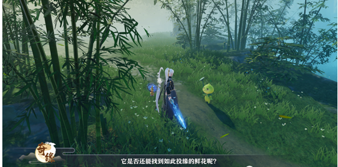
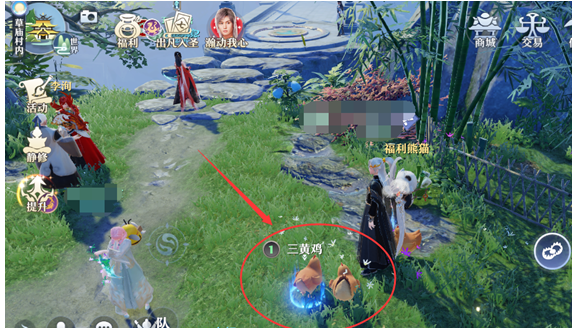
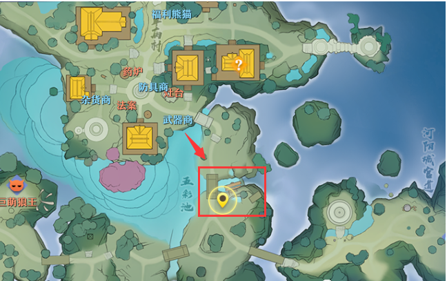
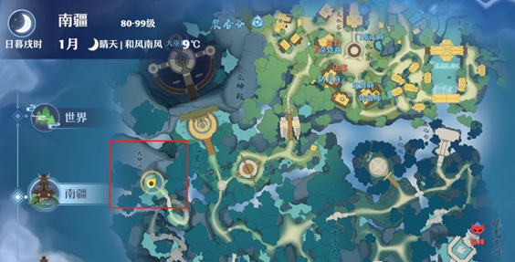
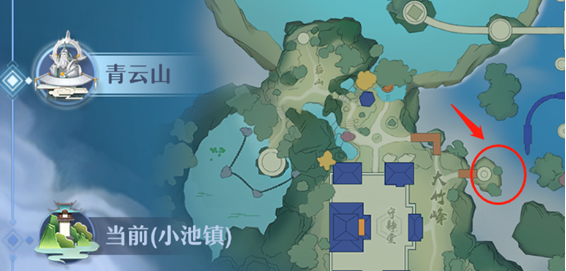
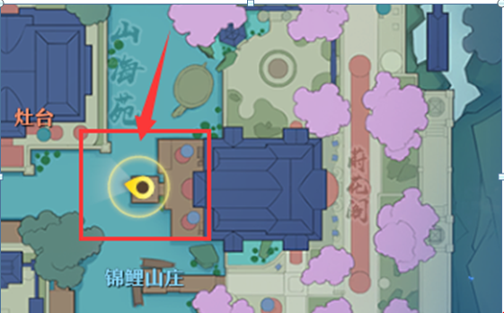
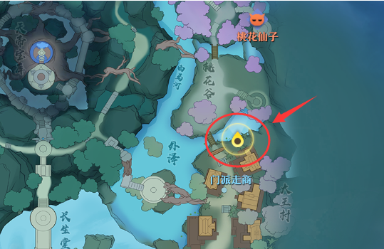
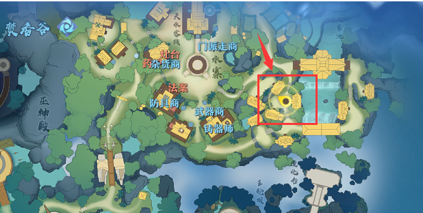
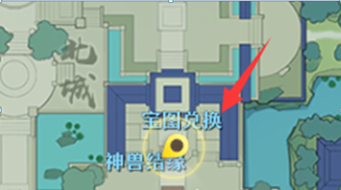

# 梦诛奇缘
序号|奇缘名称 | 触发条件|奇缘点数|触发方式
---|---|---|---|---
1|劫富济贫|无|5|采集
2|埋伏|完成劫富济贫|10|采集
3|陷阱|无|10|采集
4|仗剑|无|10|采集
5|美丽黑火|无|5|采集
6|小草妖|草庙村|10|
7|莲子|白天|5|采集
8|可疑交易|无|10|采集
9|回购|完成可疑交易|10|采集
10|冤罪|无|10|采集
11|扭曲黑火|无|10|捕捉成功
12|学习狩猎|无|10|捕捉成功
13|复习狩猎|完成学习狩猎|10|捕捉成功
14|襟师|无|10|捕捉成功
15|学霸汪|无|5|捕捉失败
16|壮师|完成学霸汪|20|小雨天捕捉成功
17|五彩浆果|无|10|捕捉失败
18|祭品|草庙村|5|捕捉成功
19|珍禽|草庙村|10|
20|老江湖|建议狐岐山钓岩蟹|10|钓鱼成功
21|大鱼|暴雨|10|钓鱼成功
22|殉情|无|10|钓鱼失败
23|断手|无|5|被牛踢飞
24|断腿|完成断手|10|被牛踢飞
25|纵目面具|草庙村|5|
26|长歌当哭|无|5|走进萤火虫
27|坐骑|南疆|20|
28|毛躁劫匪|无|10|雷击
29|过电|无|10|雷击
30|锦鲤|无|10|雪击
31|报偿|无|10|雷击
32|救助|无|10|编蝠群
33|虚弱男子|无|5|编蝠群
34|不眠之夜|夜晚|5|睡觉
35|信|夜晚|5|睡觉
36|入梦|无|10|睡觉
37|无名洞府|无|10|坠崖
38|玉璧|须弥山|10|坠崖
39|男与女|无|10|坠崖
40|迟来机缘|青云山|5|坠厘
41|血色黑火|青云山|10|坠崖
42|火灵|无|5|坠入岩浆
43|恶鬼|狐岐山|5|坠入岩浆
44|水鬼|无|5|游泳
45|沉船|无|5|游泳
46|水底|无|10|游泳
47|见者有份|无|10|福缘宝箱
48|可疑财宝|无|10|福缘宝箱
49|财神|帮派|5|抢到红包
50|鸟身人面|青云山|10|
51|仙鹤（暂不可完成）|青云山|10|御剑飞行
52|落水之声|暴雨|5|
53|箱中女子|钓40级的老鼋|20|钓鱼成功
54|雨中倩影|持有精美的香囊|10|河阳城中（下面有具体地图）
55|痛不欲生|完成雨中倩影 死亡沼泽|5|
56|无动于衷|完成痛不欲生 南疆赛边|5|
57|幡然醒悟|完成无动于衷|20|
58|守护神|完成回购、祭品|20|御剑飞|
59|铜神树|铜神树附近|20|
60|送别|隐藏|20|御剑飞行
61|监禁|隐藏|20|睡觉
62|地底秘密|隐藏|20|被牛踢飞
63|雷阵|隐藏|20|暴雨御剑飞行
64|貔貅|隐藏|20|草庙村坠崖
65|神秘坛子|隐藏|20|采集
66|好猎人|完成学习狩猎、复习狩猎|20|捕捉成功